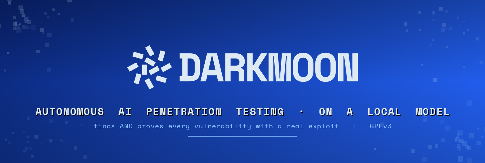
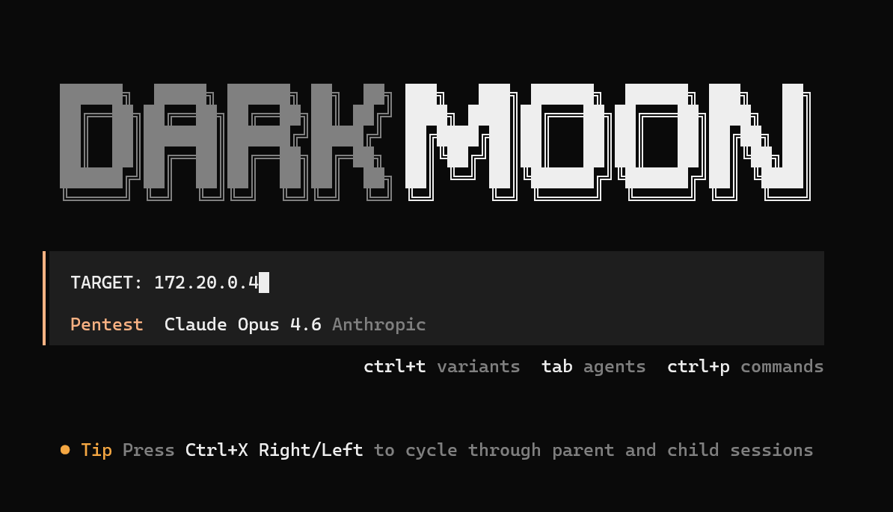
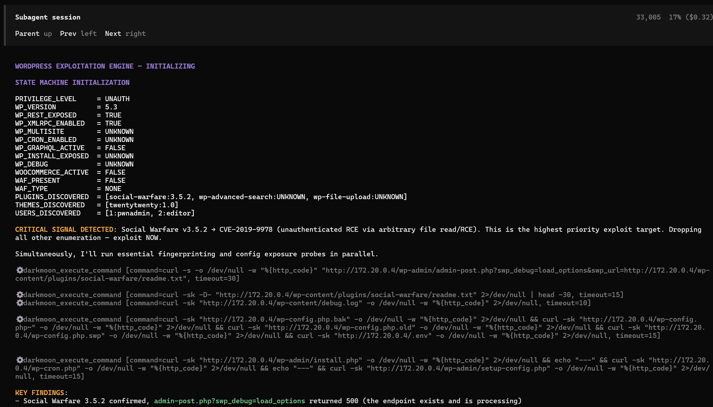
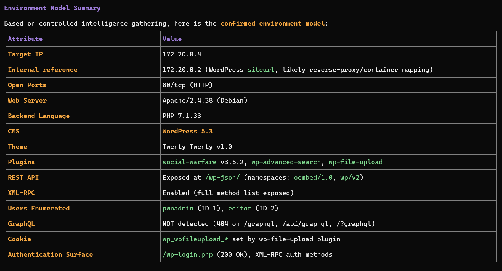
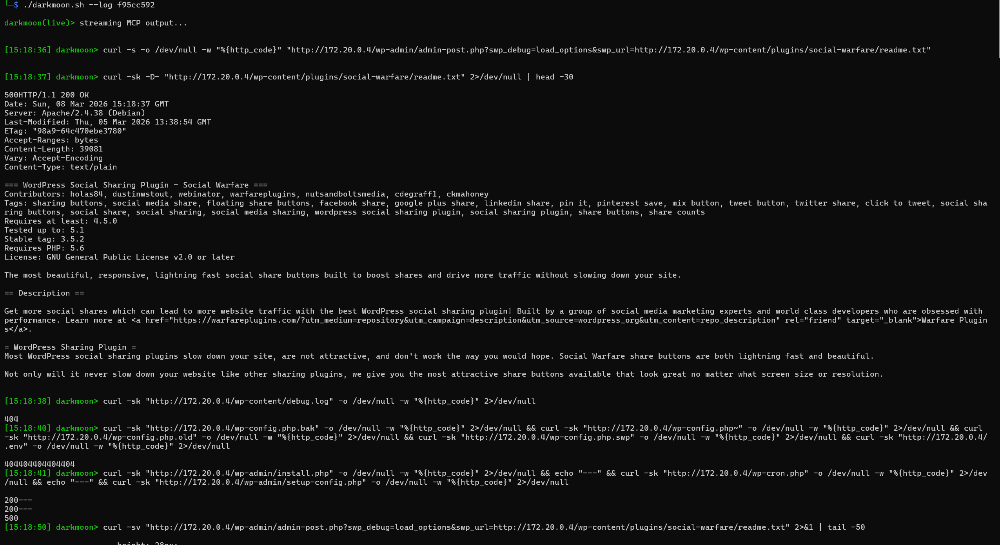
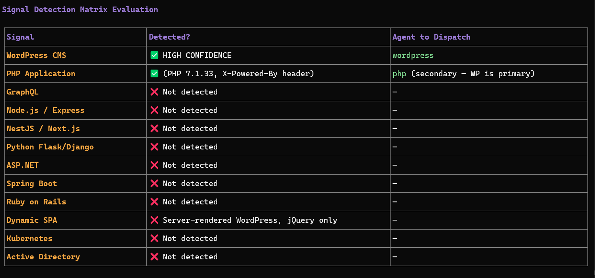
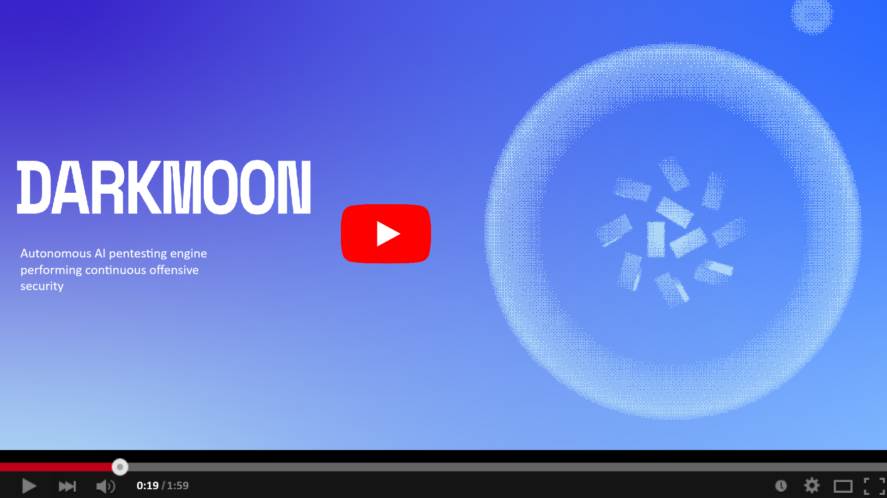
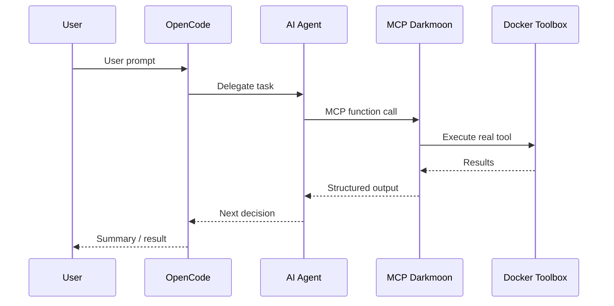

<div align="center">

<a href="https://github.com/ASCIT31/Dark-Moon">
  
</a>

# DarkMoon

### Open-source autonomous AI penetration testing platform that finds and proves every vulnerability with a real exploit, on a local model

<p>
<a href="https://github.com/ASCIT31/Dark-Moon"></a>
<a href="https://github.com/ASCIT31/Dark-Moon/releases"></a>
<a href="https://www.gnu.org/licenses/gpl-3.0"></a>
<a href="#quick-start"></a>
<a href="https://github.com/ASCIT31/Dark-Moon"></a>
</p>

[**⭐ Star DarkMoon**](https://github.com/ASCIT31/Dark-Moon) · [**▶️ Watch the demo**](https://youtu.be/1bFRVuMkZzY?si=peKxwuxzbXBnb2zO) · [**🚀 Quick Start**](#quick-start) · [**📊 Benchmark**](#-benchmark-57-real-vulnerabilities-on-owasp-juice-shop) · [**🧾 Remediation (Pro)**](https://dark-moon.org/remediation-benchmark/)

</div>

**DarkMoon is autonomous AI penetration testing for your own infrastructure.** Point it at an authorized target and it runs the whole assessment on its own, then returns proof for every finding.

- 🟢 **Truly open source.** GPLv3 and self-hosted, every agent's methodology is plain Markdown you can read, diff and fork.
- 🎯 **Finds AND proves.** Each vulnerability ships with the exact command, the raw output and a working exploit, so there is almost nothing to triage.
- 🔒 **Runs on a local LLM + Privacy Gateway.** The gateway tokenizes your real IPs, hosts and credentials locally, so the model reasons on placeholders while real values stay on your perimeter.

---

<div align="center">

## See DarkMoon in action, live in your terminal

The open-source engine is a CLI tool. You launch an assessment from the command line and watch every agent, command and finding stream past in real time.

</div>

<table>
<tr>
<td width="50%" valign="top">

<p align="center"><b>Kick off a run from the CLI.</b> One <code>TARGET</code> line and DarkMoon takes over the whole assessment.</p>
</td>
<td width="50%" valign="top">

<p align="center"><b>Autonomous agents reason and exploit, live in your terminal.</b> Here a sub-agent flags CVE-2019-9978 and pivots straight to exploitation.</p>
</td>
</tr>
<tr>
<td width="50%" valign="top">

<p align="center"><b>Recon and environment model.</b> DarkMoon fingerprints the stack and confirms the attack surface before it strikes.</p>
</td>
<td width="50%" valign="top">

<p align="center"><b>Live MCP stream.</b> Every command the agent runs and its raw output, timestamped, with <code>./darkmoon.sh --log &lt;session&gt;</code>.</p>
</td>
</tr>
</table>

<div align="center">

<p><b>Signal to agent dispatch.</b> DarkMoon decides which specialist agents to deploy from exactly what it detects on the target.</p>
</div>

<div align="center">

<a href="https://youtu.be/1bFRVuMkZzY?si=peKxwuxzbXBnb2zO">
  
</a>

**▶️ Watch DarkMoon run a full autonomous penetration test**

**As featured in** [Help Net Security](https://www.helpnetsecurity.com/2026/06/29/darkmoon-open-source-ai-pentesting-platform/) · [Cyber Security News](https://cybersecuritynews.com/darkmoon-penetration-testing-platform/) · [DevOps.com](https://devops.com/why-ci-cd-security-testing-is-going-autonomous-and-why-it-should-stay-local/) · [SecurityBrief](https://securitybrief.co.uk/story/asc-it-launches-darkmoon-for-private-ai-pentesting) · [LinuxLinks](https://www.linuxlinks.com/darkmoon-ai-powered-autonomous-penetration-testing-platform/) · [IT Brief](https://itbrief.co.uk/story/asc-it-launches-darkmoon-for-private-ai-pentesting) · [ChannelLife](https://channellife.co.uk/story/asc-it-launches-darkmoon-for-private-ai-pentesting)

</div>

---

## Quick Start

```bash
git clone https://github.com/ASCIT31/Dark-Moon.git
cd Dark-Moon
./install.sh
```

`install.sh` configures your LLM provider interactively (no need to edit `docker-compose.yml`) and builds the full stack:

```bash
./install.sh           # skip form if .opencode.env already configured
./install.sh --init    # force reconfiguration (cloud or local model)
./install.sh --help    # show usage
```

Supports **cloud providers** (Anthropic, OpenAI, OpenRouter…) and **local models** (Ollama, llama.cpp). Then run your first assessment and watch it live:

```bash
./darkmoon.sh "TARGET: example.com"
./darkmoon.sh --log <session_id>
```

**Prerequisites:** Docker & Docker Compose, and an LLM API key (or a local model). GPU setup, environment variables and the full flags reference live in the [Full Documentation](docs/full.md).

---

## Feature grid

| | |
|---|---|
| 🧠 **50 specialist agents** | One agentic system reasons, plans and dispatches specialist agents across every surface it discovers. |
| 🌐 **Every surface** | Web, APIs, Active Directory, Kubernetes, cloud (AWS, Azure, GCP), CI/CD, databases, IoT firmware and AI/LLM endpoints, chained end to end. |
| 🔒 **Privacy Gateway** | Reversible local tokenization turns real IPs, hosts, URLs and credentials into deterministic placeholders, rehydrated only locally at the moment a tool runs. |
| 🏠 **Local model** | Run the whole assessment on a local LLM (Ollama, llama.cpp) so your infrastructure values stay on your own perimeter. |
| 🧾 **Proof, not scores** | Every finding ships with the exact command, raw output and a reproducible exploit. |
| 🛡️ **Security by design** | The AI never runs a command directly, every action flows through a controlled, logged MCP interface. |
| 🤖 **Pentests your AI too** | A dedicated LLM agent probes AI/LLM inference endpoints for the OWASP LLM Top 10 with garak-backed probes. |
| ♾️ **CI/CD native** | Trigger a pentest in the pipeline and get findings back as artifacts. |
| 🔌 **MCP + n8n** | Orchestrate 50+ offensive tools over MCP, and drive DarkMoon from an [n8n workflow](docs/n8n-integration.md). |
| 🔧 **Fix it (Pro)** | The paid Pro tier turns findings into human-reviewed pull requests, retested against the original exploit. |

Built for **security teams**, **DevSecOps engineers**, **red teamers** and **ethical hacking** professionals.

---

## From finding to fix, the Pro way

> **Pro tier feature.** The open-source engine finds and proves vulnerabilities. Automated remediation into pull requests is a **paid Pro-only** capability.

In the paid Pro tier, every finding flows _finding → sandbox-validated fix → **human-reviewed pull request, retested against the original exploit**_, and is never auto-merged. On our OWASP Juice Shop demonstration, the Pro remediation agent **fixed 42 of 57 findings end-to-end with a clean live exploit-retest** (a fix only counts when the original exploit is re-run and confirmed closed). See the [remediation benchmark](https://dark-moon.org/remediation-benchmark/), the [remediation agent docs](docs/remediation-agent.md) and the [57 open PRs on ASCIT31/juice-shop](https://github.com/ASCIT31/juice-shop/pulls).

---

## What is DarkMoon?

DarkMoon is an **open-source AI penetration testing** platform. Point it at a target you are authorized to test, and it runs the whole assessment on its own: it reasons, plans, and dispatches **50 specialist agents** that execute real offensive operations through a controlled MCP layer, then reports every vulnerability with the exact command, the raw output and the proof behind it.

It does not replace the pentester. It clears the repetitive part of an assessment with evidence, so your experts spend their time on judgment, not toil.

---

## 📊 Benchmark: 57 real vulnerabilities on OWASP Juice Shop

Real, reproducible **black-box** run against OWASP Juice Shop on a **local LLM** (nothing leaves your infrastructure):

| Metric | Result |
|---|---|
| Vulnerabilities found | **57** (8 critical / 24 high / 21 medium / 4 low) |
| Wall-clock time | **28.5 min** |
| Proof-of-exploitation | per finding |
| LLM | local (Ollama / llama.cpp) |

Reproduce it and compare tools yourself: **[ASCIT31/Darkmoon-Benchmarks](https://github.com/ASCIT31/Darkmoon-Benchmarks)**.

## 🆚 How DarkMoon compares

| | **DarkMoon** | strix | shannon | PentAGI |
|---|:--:|:--:|:--:|:--:|
| Runs on **local LLM** (data never leaves) | ✅ | ❌ cloud | ❌ cloud | partial |
| Privacy Gateway (local tokenization) | ✅ | ❌ | ❌ | ❌ |
| Active Directory + Kubernetes | ✅ | ❌ | ❌ | partial |
| Proof-of-exploitation | ✅ | ✅ | ✅ | ✅ |
| Open source | ✅ GPL-3.0 | ✅ | ✅ | ✅ |

*Compiled from public repos/docs (2026-08); corrections welcome via PR.*

---

## How It Works

DarkMoon operates as a strategic **AI security agent** orchestrator aligned with ISO 27001, NIST SP 800-115, and MITRE ATT&CK methodologies.

When you provide a target, the platform automatically:

1. 🔍 **Discovers** the target environment (ports, services, protocols)
2. 🧠 **Fingerprints** the technology stack (frameworks, CMS, APIs)
3. 🎯 **Models** the attack surface
4. 🚀 **Deploys** specialized sub-agents based on detected technologies
5. 🔬 **Executes** an **intelligent vulnerability scanning** loop with reactive adaptation
6. ✅ **Validates** findings with evidence (requests, payloads, responses)
7. 📝 **Generates** a structured audit report

### Sub-Agent Orchestration

DarkMoon dynamically selects and dispatches specialized agents depending on the technologies discovered:

| Detected Technology | Agent Triggered |
|---|---|
| WordPress, Drupal, Joomla, Magento, PrestaShop, Moodle | CMS-specific agent |
| PHP, Node.js, Flask, ASP.NET, Spring Boot, Ruby on Rails, Go | Stack-specific agent |
| GraphQL | GraphQL agent |
| LLM / AI inference endpoint (OpenAI-compatible, Ollama, vLLM, TGI) | LLM agent |
| Active Directory | AD agent |
| Kubernetes | Kubernetes agent |
| AWS, Azure, GCP | Cloud-provider agent |
| Entra ID (Microsoft identity) | Identity agent |
| GitHub, GitLab, Jenkins | SCM & CI/CD agent |
| Terraform, Ansible | Infrastructure-as-Code agent |
| Docker, container registries | Container agent |
| HashiCorp Vault | Secrets agent |
| PostgreSQL, MySQL, MSSQL, Oracle | Database agent |
| Redis, RabbitMQ, Kafka, MQTT | Messaging & cache agent |
| Firmware / IoT images | Firmware agent |
| Headless browser required | Headless browser agent |

Multiple agents can execute **in parallel** across hybrid architectures.

Planes that require credentials to be meaningful (cloud accounts, CI/CD, secret stores, databases, Active Directory, Kubernetes) are **never dispatched on inference**. They fire only when a concrete artifact is found (a key, a token, a reachable metadata endpoint) or when you authorize them explicitly, and are otherwise flagged in the report.

> **Note:** For the complete list of agents, their structure, lifecycle, and how to create custom agents, see [Full Documentation, AI Agents](docs/full.md#v-ai-agents).

### Architecture Overview

```
User ──> DarkmoonCLI ──> OpenCode (AI Brain) ──> MCP (Security Gatekeeper) ──> Docker Toolbox (Real Tools)
```



The AI reasons and plans. The MCP controls what can be executed. The Toolbox runs isolated tools inside Docker. **The AI never directly touches the system**, this is **security by design**.

> **Note:** For the full architecture breakdown (deployment diagrams, network flows, security boundaries), see [Full Documentation, Architecture](docs/full.md#iv-architecture).

---

## Scope Definition

DarkMoon supports flexible scope definition directly from the command line.

**Quick pentest (zero config):**

```bash
./darkmoon.sh "TARGET: http://172.19.0.3:3000"
```

**Bug bounty mode (flags activate automatically):**

```bash
./darkmoon.sh "TARGET: http://172.19.0.3:3000 PROGRAM=\"Juice Shop\" FOCUS=sqli,xss,idor NOISE=moderate FORMAT=h1"
```

Key flags include `FOCUS`, `EXCLUDE`, `CREDS`, `TOKEN`, `NOISE`, `SEVERITY`, `FORMAT`, and more, all interpreted naturally by the AI.

> **Note:** For the complete flags reference, asset types, EXCLUDE/FOCUS free-form syntax, and advanced multi-target scoping, see [Full Documentation, Scope Definition](docs/full.md#ii7c-launch-darkmoon-with-tui-console).

---

## Integrated Toolbox

DarkMoon ships with a purpose-built Docker image containing **50+ security tools** compiled and optimized in a multi-stage build:

| Category | Tools (examples) |
|---|---|
| Port scanning | Naabu (discovery), nmap (targeted service probes) |
| Web scanning | Nuclei, ffuf, dirb, sqlmap, Arjun, wafw00f |
| Recon & crawling | Subfinder, Katana, Waybackurls, httpx |
| CMS | WPScan, CMSeeK, WhatWeb |
| Active Directory | NetExec, BloodHound, Impacket (30+ scripts) |
| Kubernetes | kubectl, Kubescape, Kubeletctl, kube-bench, rbac-police |
| Cloud CLIs | aws, az, gcloud, gsutil, bq |
| Databases & cache | psql, mysql, redis-cli, sqlite3 |
| Firmware / IoT | binwalk, unsquashfs, sasquatch, firmwalker |
| Cracking | hashcat, john, 7z2john |
| Network | Hydra, curl, dig, SNMP tools |
| Browser | Lightpanda (headless) |

All tools are directly accessible, no path configuration needed.

> **Note:** For the complete tools list with installation details and how to add new tools, see [Full Documentation, Toolbox](docs/full.md#vi-toolbox).

---

## 📖 Documentation Guide

DarkMoon's [Full Documentation](docs/full.md) covers everything you need to operate the platform. Here is a quick reference to the most important sections:

| Topic | What You'll Find | Link |
|---|---|---|
| **GPU & Driver Setup** | NVIDIA troubleshooting for Docker, WSL, and native Linux | [GPU Guide](docs/full.md#ii2--darkmoon--gpu-troubleshooting-guide-official) |
| **Environment Variables** | LLM provider configuration, API keys, model selection | [Environment Config](docs/full.md#ii3-configuration-of-environment-variables-in-docker-compose) |
| **Startup & Build** | install.sh behavior, docker compose build, stack management | [Build & Launch](docs/full.md#ii6-build-and-launch-darkmoon) |
| **Scope & Flags** | TARGET syntax, bug bounty mode, FOCUS/EXCLUDE, credentials | [Scope Definition](docs/full.md#ii7c-launch-darkmoon-with-tui-console) |
| **Assessment Workflow** | Step-by-step: discovery, fingerprinting, agents, reporting | [Assessment Engine](docs/full.md#ii7d-how-to-use-the-darkmoon-assessment-engine) |
| **Real-Time Session Logs** | Monitor commands executed by the MCP server live | [Session Logs](docs/full.md#ii7e-step-1--start-an-assessment) |
| **AI Agents** | Agent structure, lifecycle, how to create or modify agents | [AI Agents](docs/full.md#v-ai-agents) |
| **Architecture** | Deployment diagrams, security boundaries, execution flow | [Architecture](docs/full.md#iv-architecture) |
| **Toolbox** | Complete tool list, adding tools, Docker image internals | [Toolbox](docs/full.md#vi-toolbox) |
| **MCP Workflows** | Workflow structure, creating custom workflows, best practices | [MCP Workflows](docs/full.md#vii-mcp-workflows) |
| **Available Tools List** | Full table of 50+ tools with paths and sources | [Tools List](docs/full.md#vi10-toolbox-list) |
| **Training Labs** | Recommended vulnerable labs to train DarkMoon | [Pentester Labs](docs/full.md#vi11-bonus-pentester-lab-to-train-darkmoon) |
| **Remediation Agent** (Pro) | Findings → sandbox-validated fix → pull request for human review (never merged) | [Remediation Agent](docs/remediation-agent.md) |
| **n8n Integration** | Community node to trigger a pentest, pull findings and review fix PRs from an n8n workflow | [n8n Node](docs/n8n-integration.md) |

---

## Use Cases

DarkMoon is designed as a versatile **security testing platform** for:

- 🔒 **Security teams**, run continuous **automated penetration testing** across your infrastructure
- ⚙️ **DevSecOps pipelines**, integrate **AI-driven security research** into CI/CD workflows
- 🎯 **Bug bounty hunters**, accelerate **ethical hacking** with autonomous target analysis
- 🔬 **Security researchers**, explore attack surfaces with an **AI cybersecurity platform** that adapts in real time
- 🎓 **Training & education**, learn offensive security with guided, reproducible assessments

---

## Example Prompts

```bash
# Web application pentest
./darkmoon.sh "TARGET: http://172.19.0.3:3000"

# Active Directory assessment
./darkmoon.sh "TARGET: 192.168.1.10"

# Bug bounty with specific focus
./darkmoon.sh "TARGET: https://app.example.com PROGRAM=\"Example BB\" FOCUS=sqli,rce,ssrf EXCLUDE=H1 FORMAT=h1"
```

> **Note:** For more prompt examples including DVGA, Juice Shop, and headless browser scenarios, see [Full Documentation, Prompt Examples](docs/full.md#iii-uses).

---

## Contributing

DarkMoon is open source and welcomes contributions. Whether you want to add new agents, integrate tools, create workflows, or improve documentation, see [CONTRIBUTING.md](CONTRIBUTING.md) for guidelines.

---

## License

This project is licensed under the **GNU General Public License v3.0**. See [LICENSE](LICENSE) for details.

---

<div align="center">

**Built by ASC-IT with 💚 for the global security community**

🔒 Open Source · 🤖 AI-Powered · 🇫🇷 Made in France

[⭐ Star us on GitHub](https://github.com/ASCIT31/Dark-Moon) · [📖 Full Documentation](docs/full.md) · [▶️ Watch the Demo](https://youtu.be/1bFRVuMkZzY?si=peKxwuxzbXBnb2zO)

</div>
